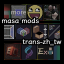

# Translation-zh_tw-of-masa-series-mods

## masa系模組繁中本地化翻譯_trans-zh_tw_by_BK

主要進行簡中翻譯轉繁中翻譯，並加上一定程度的本地化。

2024-05-04:

本項目經過多次疊代，少不了中文化的幾位貢獻者，故表列於此：

- [醉梦巅峰](https://space.bilibili.com/13205801/)
  > **[【1.20.1masa 汉化发布——投影用不了了？？？】](https://www.bilibili.com/video/BV1pX4y1t7jA/?share_source=copy_web&vd_source=c4c35fc5c114965a4ac505990c951fd8 "簡中翻譯：醉梦巅峰")** 簡中翻譯：醉梦巅峰
  >
  > 最初的漢化者，製作了原作者 masa 沒有提供的鍵值對翻譯文件
  >
  > 讓材質包漢化成為可能

- [whats2000](https://github.com/whats2000)
  > Taiwan Redstone Community 的成員
  >
  > 最早開始製作繁體中文材質包的模組翻譯項目

- ST_fox. ✨
  > 在本材質包的基礎上，製作了完整中英文的對照（AddSelectionBox | 新增選區）
  >
  > 且改進了大小寫，統一標點符號等等諸多細節

- [Blackrowtw](https://github.com/Blackrowtw)
  > 起因是看到了 Fallen-Breath 的 tweakermore 明明就有完整的中文翻譯
  >
  > 卻因為簡中繁中使用了不同的文件，而導致無法方便的使用中文的模組
  >
  > 而開始嘗試製作資源包，並開始為自己常用的模組進行繁中化

## MODs List

### 模組清單

> 按資料夾內順序

### 1. [essentialclient](https://modrinth.com/mod/essentialclient "") ^[Carpet附屬mod、clientscript、ChunkDebug] 作者：[senseiwells](https://github.com/senseiwells)

    - 模組名：EssentialClient
    - 模組功能：原先是 Carpet mod 的一個分支
    有自己的介面操作可以操作 Carpet 的各種功能。
    有可視化的介面操作 Catpet 和 Minecraft 的 gamerule
    Client Script 客戶端腳本、 ChunkDebug 等功能。

### 2. [explayerenderer](https://modrinth.com/mod/extraplayerrenderer "") ^[額外玩家渲染] 作者：[禄存天玑](https://space.bilibili.com/2117299?spm_id_from=333.337.0.0)

    - 模組名：Extra Player Renderer (Paper Doll)
    - 常見名稱：額外玩家渲染
    - 依賴：malilib
    - 模組功能：在遊戲內另外渲染一個玩家模型，時實顯示目前玩家的動作
    可以做到類似 live2D 的效果，有 masa 系模組高度可定義的特點。

### 3. [itemscroller](https://www.curseforge.com/minecraft/mc-mods/item-scroller "") ^[物品滾輪、批量合成] 作者：[masady](https://www.curseforge.com/members/masady/projects)

    - 模組名：Item Scroller 
    - 常見名稱：物品滾輪、批量合成
    - 依賴：malilib
    - 模組功能：添加滑鼠手勢，快速移動同類物品等等，方便操作遊戲內道具的功能。
    可以記錄下需要的合成表，並使用快捷鍵一次合成身上所有的物品。

### 4. [litematica](https://www.curseforge.com/minecraft/mc-mods/litematica "") ^[投影、小木棍] 作者：[masady](https://www.curseforge.com/members/masady/projects)

    - 模組名：Litematica
    - 常見名稱：投影、小木棍
    - 依賴：malilib
    - 模組功能：做紅石機器必不可少的核心模組。
    可以在遊戲內顯示預先儲存的建築藍圖，並且在放錯方快、狀態不對時醒目顯示。
    生存可用的功能較少，在創造模式中可以更為方便的複製貼上。

### 5.  [magiclib](https://github.com/Hendrix-Shen/MagicLib "") ^[OMMC：gadget依賴] 作者：[plusls](https://space.bilibili.com/6400543/)、[Hendrix-Shen](https://github.com/Hendrix-Shen)

    - 模組名：MagicLib
    - 常見名稱：魔法類庫
    - 模組功能：為 Masa Gadget, OMMC 使用必須的依賴模組。

### 6. [malilib](https://www.curseforge.com/minecraft/mc-mods/malilib "") ^[masa-mods依賴] 作者：[masady](https://www.curseforge.com/members/masady/projects)

    - 模組名：MaLiLib
    - 常見名稱：masa 全家桶、 masa 庫
    - 模組功能：最核心的插件，為所有 masa 系列模組的依賴。
    可以說由 masa 和 Carpet 造就如今的生電。

### 7. [masa_gadget_mod](https://modrinth.com/mod/masa-gadget "") ^[渲染村民交易] 作者：[plusls](https://space.bilibili.com/6400543/)、[Hendrix-Shen](https://github.com/Hendrix-Shen)

    - 模組名：Masa Gadget
    - 常見名稱：小東西模組、玩家輪椅(?)
    - 依賴：malilib, magiclib
    - 模組功能：渲染村民交易的第一本附魔書，以及其他族繁不足紀載的功能。
    可看 [黑山大叔的介紹](https://www.bilibili.com/video/BV1J64y1j7Y3/)

### 8. [minihud](https://www.curseforge.com/minecraft/mc-mods/minihud "") ^[迷你HUD、加載球面] 作者：[masady](https://www.curseforge.com/members/masady/projects)、[Hendrix-Shen](https://github.com/Hendrix-Shen)

    - 模組名：MiniHUD
    - 常見名稱：迷你F3
    - 依賴：malilib
    - 模組功能：可以顯示各種資訊在畫面上，常用有 F3 資料、結構範圍、刷怪範圍
    另外還有水流狀態、烽火台範圍、方塊碰撞箱、生物巡路...等等各種可自定義的功能。

### 9. [ommc](https://github.com/plusls/oh-my-minecraft-client "") ^[世吞小助手] 作者：[plusls](https://space.bilibili.com/6400543/) | [後續接手倉庫](https://github.com/Nyan-Work/oh-my-minecraft-client)

    - 模組名：[OMMC]Oh My Minecraft Client
    - 常見名稱：~~我怎麼就管不住這手呢~~
    - 依賴：malilib, magiclib
    - 模組功能：masa 系模組添加最愛功能，介面增加選單切換不同模組
    高亮實體、世吞小助手等等其他族繁不足紀載的功能。
    原作者倉庫不再更新 

### 10. [syncmatica](https://modrinth.com/mod/syncmatica "") ^[共享投影] 來自：[EndTech](https://github.com/End-Tech)

    - 模組名：Syncmatica
    - 常見名稱：共享投影
    - 依賴：malilibㄝ, litematica
    - 模組功能：進入伺服器需要的模組，可以讓線上玩家使用共同的投影文件作業。
    當然前提是該伺服器有安裝對應的功能。

### 11. [tweakermore](https://modrinth.com/mod/tweakermore "") ^[by.Fallen-Breath] 作者：[Fallen-Breath](https://github.com/Fallen-Breath)

    - 模組名：TweakerMore
    - 由 Fallen-Breath 出品
    - 依賴：malilib
    - 模組功能：為 masa 系模組提供雙語顯示、一鍵丟出/放入所有物品到容器、界伏盒存量顯示、投影智慧放置。
    以及各種調整遊戲內顯示、資訊等等更進階的功能。

### 12. [tweakeroo](https://www.curseforge.com/minecraft/mc-mods/tweakeroo "") ^[靈魂出竅] 作者：[masady](https://www.curseforge.com/members/masady/projects)

    - 模組名：Tweakeroo
    - 常見名稱：靈魂出竅
    - 依賴：malilib
    - 模組功能：靈魂出竅(Free Cam 自由相機)、快速放置、偽潛行、取消粒子效果
    等等各種調整遊戲的行為功能，masa 系列功能最豐富的模組。

### 13. [tweakmyclient](https://www.curseforge.com/minecraft/mc-mods/tweakmyclient "") ^[Tweak My Client] 作者：[Hendrix-Shen](https://github.com/Hendrix-Shen)

    - 模組名：Tweakmyclient
    - 由 Hendrix-Shen 製作
    - 依賴：malilib, magiclib
    - 模組功能：自動丟棄物品、自動圖騰，以及各種更為客製化的功能。

---

## 本倉庫材質包的實現方式

### 最初的工作流程：

從模組本身以及其他各處搜刮來的簡體 json 檔案

使用 [OpenCC](https://opencc.byvoid.com/) 進行簡繁轉換

最後再額外替換各種歧異字詞與 MC 的翻譯詞。

### 2024-05-04：

開始使用 github 進行版本管理

並以 action 功能製作最終的發行版本。

當使用 tag 上傳到本倉庫時觸發 action 自動生成材質包。

觸發詞為：`release_v_`。

git 指令使用例：

`git tag -a release_v_1.20.1 -m "發佈版 release_v_1.20.1"`

`git push origin release_v_1.20.1`

### 2024-06-21：

利用 SkyEye_FAST 製作的 [Minecraft 翻譯對照表](https://mcst.teahouse.team/table)

開始製作 JS 程序 [OpenCC.js](https://github.com/nk2028/opencc-js/blob/main/README-zh-TW.md) 進行繁中自動化

---

## zh_cn to zh_tw dissenting phrases Memo

### 2024-06-21：

已棄用，留作紀錄

### 簡轉繁歧異詞備忘錄

| **簡體原文** | **簡-繁轉換** | **用詞修正** |
| :----------: | :-----------: | :----------: |
|    服务端    |    服務端     |   伺服器端   |
|    服务器    |    服務器     |    伺服器    |
|    局域网    |    局域網     |    區域網    |
|     內存     |     內存      |    記憶體    |
|    分辨率    |    分辨率     |    解析度    |
|     鼠标     |     鼠標      |     游標     |
|     屏幕     |     屏幕      |     螢幕     |
|     窗口     |     窗口      |     視窗     |
|     粘贴     |     粘貼      |     貼上     |
|     复制     |     复制      |     複製     |
|    剪贴板    |    剪貼板     |    剪貼簿    |
|     调试     |     調試      |     除錯     |
|     热键     |     熱鍵      |    快捷鍵    |
|     激活     |     激活      |     觸發     |
|     冲突     |     沖突      |     衝突     |
|     松开     |     松開      |     鬆開     |
|    布尔值    |    布爾值     |    布林值    |
|     打印     |     打印      |     列印     |
|     链接     |     鏈接      |     連結     |
|     信息     |     信息      |     資訊     |
|     这里     |     這里      |     這裡     |
|     拾取     |     拾取      |     撿取     |
|     回归     |     迴歸      |     回歸     |
|     覆写     |     覆寫      |     覆蓋     |
|     校验     |     校驗      |     驗證     |
|     配置     |     配置      |     設定     |
|     設置     |     設置      |     設定     |
|    控制台    |    控制檯     |    控制台    |
|     背包     |     揹包      |     背包     |
|     炸毁     |     炸燬      |     炸毁     |
|     冲突     |     沖突      |     衝突     |
|     修覆     |     修覆      |     修復     |

| **簡體官方** | **簡-繁轉換** | **繁中官方** |
| :----------: | :-----------: | :----------: |
|     下界     |     下界      |     地獄     |
|     末地     |     末地      |     終界     |
|    潜影盒    |    潛影盒     |    界伏盒    |
|    末影箱    |    末影箱     |    終界箱    |
|   烟花火箭   |   煙花火箭    |     煙火     |
|    粘液块    |    粘液塊     |  史萊姆方塊  |
|     信标     |     信標      |    烽火台    |
|   潮涌核心   |   潮湧核心    |   海靈核心   |
|   潜声植物   |   潛聲植物    |  伏聆振測器  |
|    工作台    |    工作臺     |    工作台    |

