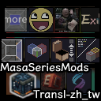

# Translation-zh_tw-of-masa-series-mods

## masa系模組繁中本地化翻譯_trans-zh_tw_by_BK
---

主要進行簡中翻譯轉繁中翻譯，並加上一定程度的本地化

---

### MODs List

#### 模組清單

主要來源：
**[【1.20.1masa 汉化发布——投影用不了了？？？】](https://www.bilibili.com/video/BV1pX4y1t7jA/?share_source=copy_web&vd_source=c4c35fc5c114965a4ac505990c951fd8 "簡中翻譯：醉梦巅峰")** 簡中翻譯：醉梦巅峰

1. [itemscroller](https://www.curseforge.com/minecraft/mc-mods/item-scroller"") ^[物品滾輪、批量合成]
2. [litematica](https://www.curseforge.com/minecraft/mc-mods/litematica "") ^[投影、小木棍]
3. [malilib](https://www.curseforge.com/minecraft/mc-mods/malilib "") ^[masa代碼庫]
4. [minihud](https://www.curseforge.com/minecraft/mc-mods/minihud "") ^[迷你HUD、加載球面]
5. [tweakeroo](https://www.curseforge.com/minecraft/mc-mods/tweakeroo "") ^[靈魂出竅]
6. [tweakermore](https://modrinth.com/mod/tweakermore "") ^[by.Fallen-Breath]
7. [masa_gadget_mod](https://modrinth.com/mod/masa-gadget "") ^[渲染村民交易]
8. [ommc](https://github.com/plusls/oh-my-minecraft-client "") ^[世吞小工具]
9. [magiclib](https://github.com/Hendrix-Shen/MagicLib "") ^[OMMC：gadget代碼庫]
10. [explayerenderer](https://modrinth.com/mod/extraplayerrenderer "") ^[額外玩家渲染]
11. [syncmatica](https://modrinth.com/mod/syncmatica "") ^[共享投影]
12. [essentialclient](https://modrinth.com/mod/essentialclient "") ^[Carpet附屬mod、clientscript、ChunkDebug]

---

### zh_cn to zh_tw dissenting phrases Memo

#### 簡轉繁歧異詞備忘錄

| **簡體原文** | **簡-繁轉換** | **用詞修正** |
| :----------: | :-----------: | :----------: |
|    服务端    |    服務端     |   伺服器端   |
|    服务器    |    服務器     |    伺服器    |
|    局域网    |    局域網     |    區域網    |
|     內存     |     內存      |    記憶體    |
|    分辨率    |    分辨率     |    解析度    |
|     鼠标     |     鼠標      |     游標     |
|     屏幕     |     屏幕      |     螢幕     |
|     窗口     |     窗口      |     視窗     |
|     粘贴     |     粘貼      |     貼上     |
|     复制     |     复制      |     複製     |
|    剪贴板    |    剪貼板     |    剪貼簿    |
|     调试     |     調試      |     除錯     |
|     热键     |     熱鍵      |    快捷鍵    |
|     激活     |     激活      |     觸發     |
|     冲突     |     沖突      |     衝突     |
|     松开     |     松開      |     鬆開     |
|    布尔值    |    布爾值     |    布林值    |
|     打印     |     打印      |     列印     |
|     链接     |     鏈接      |     連結     |
|     信息     |     信息      |     資訊     |
|     这里     |     這里      |     這裡     |
|     拾取     |     拾取      |     撿取     |
|     回归     |     迴歸      |     回歸     |
|     覆写     |     覆寫      |     覆蓋     |
|     校验     |     校驗      |     驗證     |
|     配置     |     配置      |     設定     |
|     設置     |     設置      |     設定     |
|    控制台    |    控制檯     |    控制台    |
|     背包     |     揹包      |     背包     |
|     炸毁     |     炸燬      |     炸毁     |
|     冲突     |     沖突      |     衝突     |
|     修覆     |     修覆      |     修復     |

| **簡體官方** | **簡-繁轉換** | **繁中官方** |
| :----------: | :-----------: | :----------: |
|     下界     |     下界      |     地獄     |
|     末地     |     末地      |     終界     |
|    潜影盒    |    潛影盒     |    界伏盒    |
|    末影箱    |    末影箱     |    終界箱    |
|   烟花火箭   |   煙花火箭    |     煙火     |
|    粘液块    |    粘液塊     |  史萊姆方塊  |
|     信标     |     信標      |    烽火台    |
|   潮涌核心   |   潮湧核心    |   海靈核心   |
|   潜声植物   |   潛聲植物    |  伏聆振測器  |
|    工作台    |    工作臺     |    工作台    |

---
### 實現方式

對從模組裡和其他各處搜刮來的原始簡體json檔案，
使用OpenCC進行轉換，最後再額外置換各種歧異字詞。

另開始使用github進行版本管理，並利用action功能製作最終的發行版本。
當使用tag上傳到本倉庫時觸發action，觸發詞為：`release_v_`
指令範例：
`git tag -a release_v_1.20.1 -m "發佈版 release_v_1.20.1"`
`git push origin release_v_1.20.1`
